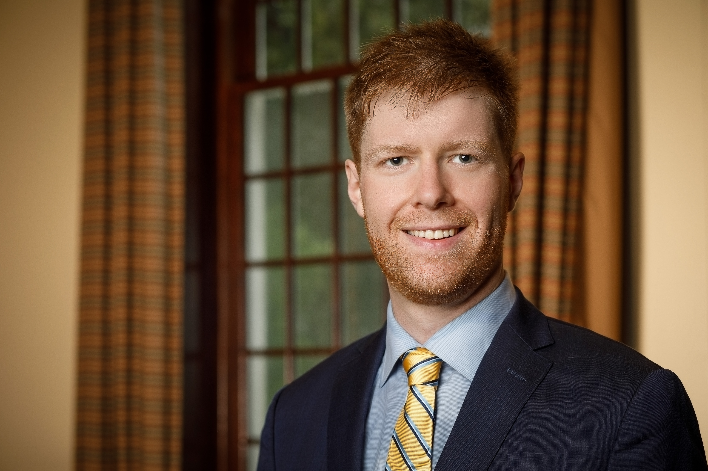

---
---

<link rel="stylesheet" href="styles.css" type="text/css">

      

In my research, I apply machine learning to problems in behavioral science, focusing on cases where we know human judgment is biased or incomplete. This is common in many facets of social interaction - friendly conversations, negotiations, meetings, and so on. When we try to understand other people's preferences and intentions, we often find that our perspective-taking capacity has room for improvement. In these cases, natural language processing can help us understand and improve the decisions people make when we talk to each other.

Currently, I am pursuing this research as a post-doctoral fellow at Harvard Business School. I completed my undergraduate degree in Psychology at the University of Toronto and I completed a PhD and an MBA in Behavioral Science at the University of Chicago Booth School of Business.

***
