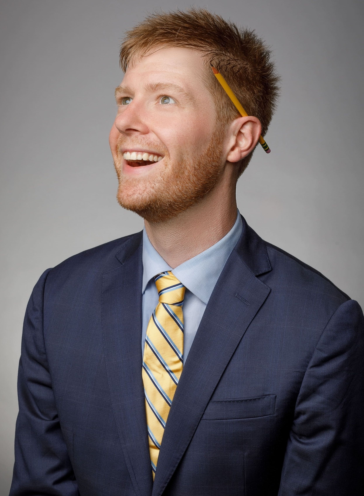

<link rel="stylesheet" href="styles.css" type="text/css">

```{css, echo=FALSE}
.wdk_content-pagetitle {
display:none;
}
```


<br/>
<div style="margin-left: 5px">

<div style="font-size: 20px">
<b>Hello, and welcome to my website! </b>I am currently an Assistant Professor in Strategy and Organisational Behaviour at Imperial College Business School.

<div style="font-size: 20px">
<b>In my research, I study the decisions we make in conversation. </b> We are a social species, doing and learning so much with one another. And the things we choose to say can have profound impacts on our relationships in business, and in life. My work explores the many ways that language technology can help us understand and improve our conversational decisions, so that we can better pursue our social goals together. 

If you'd like to have a conversation about some goals we might share - including research, teaching, speaking, or consulting - please reach out! 

</div>
***
